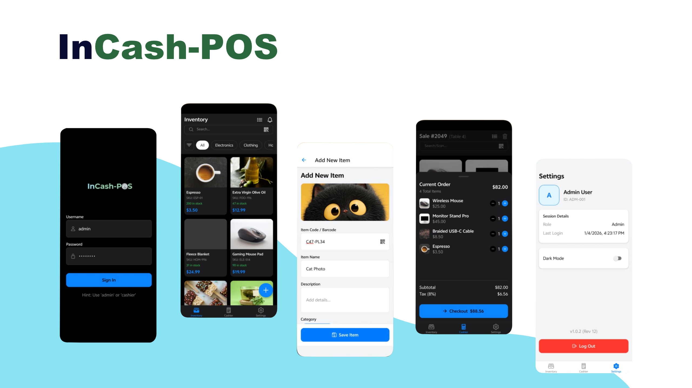

# InCash-POS

## 1. What is InCash-POS?

InCash-POS is a modern, cross-platform Point of Sales (POS) application built with React Native. It is designed to be an "offline-first" solution, ensuring that retail and F&B (Food & Beverage) businesses can continue operations smoothly even without an internet connection. The app focuses on speed, simplicity, and reliable data synchronization, creating a seamless checkout experience for cashiers and powerful insights for business owners.

## 2. Core Features

### A. Point of Sale (Checkout)
*   **Fast Transaction Processing**: Streamlined UI to add items to the cart via barcode scanning (using the device camera) or quick-tap category grids.
*   **Flexible Payments**: Supports Cash, Credit/Debit Cards (via external terminal integration), and Digital Wallets.
*   **Split Payments**: Ability to split a single bill across multiple payment methods (e.g., $20 cash, $30 card).
*   **Receipts**: Options to print physical receipts via Bluetooth/Thermal printers or send digital receipts via WhatsApp/Email.

### B. Inventory Management
*   **Real-time Tracking**: Automatic deduction of stock upon sale.
*   **Low Stock Alerts**: Visual indicators or push notifications when items fall below a defined threshold.
*   **Product Variants**: Support for different sizes, colors, or add-ons (e.g., "Coffee" with "Oat Milk" modifier).

### C. Offline Capabilities
*   **Always-On Mode**: Full functionality (sales, inventory lookup) continues when the internet goes down.
*   **Auto-Sync**: Data is locally stored and automatically synchronized with the cloud backend once connectivity is restored.

### D. Business Intelligence
*   **Dashboard**: Visual graphs showing daily sales, top-selling items, and peak business hours.
*   **Reports**: Exportable PDF/CSV reports for end-of-day reconciliation and monthly accounting.

## 3. Technical Architecture (The "Under the Hood")

Since InCash-POS is built using React Native (JavaScript), the architecture is designed for performance and scalability.

| Component | Technology / Library Recommendation |
| :--- | :--- |
| **Framework** | React Native (Expo or CLI) |
| **Language** | JavaScript (ES6+) or TypeScript (recommended for scale) |
| **Local Database** | WatermelonDB or Realm (Essential for high-performance offline data) |
| **State Management** | TanStack Query (for server state) + Zustand (for global app state) |
| **Navigation** | React Navigation (Stack & Bottom Tabs) |
| **Hardware** | react-native-thermal-receipt-printer (for ESC/POS printing) + react-native-camera (for barcode scanning) |
| **Backend API** | Node.js (Express) with REST or GraphQL |

## 4. User Roles

*   **Admin/Owner**: Full access to dashboard, analytics, staff management, and inventory adjustments.
*   **Cashier**: Restricted access limited to processing sales, viewing stock levels, and daily closing shifts.

## 5. UI/UX Design Philosophy

*   **Minimalist & High Contrast**: Buttons are large and color-coded (Green for "Pay", Red for "Cancel") to prevent errors during rush hours.
*   **Dark Mode Support**: To save battery life on devices and reduce eye strain for staff working long shifts.
*   **Responsive**: Layout adapts intelligently whether used on a small smartphone or a large landscape tablet.

## Repository Modules

- **[incash-mobile](./incash-mobile)**: The React Native mobile application for Incash.
- **[incash-api](./incash-api)**: The backend API service (Under Development).
- **[incash-web](./incash-web)**: The web dashboard interface (Under Development).
