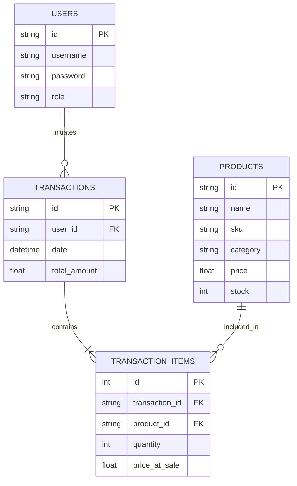

# InCash API

Backend server for InCash POS application.

## Tech Stack
- **Runtime**: Node.js
- **Framework**: Express
- **Database**: 
    - **Current**: JSON File (`src/data/db.json`) via `lowdb`-like adapter.
    - **Future**: PostgreSQL (Schema provided in `database.sql`).

## Setup

1. Install dependencies:
   ```bash
   npm install
   ```
2. Run development server:
   ```bash
   npm run dev
   ```

## Database Documentation

### Relational Schema (ER Diagram)



## API Documentation

### Authentication
- `POST /auth/login`
    - Body: `{ "username": "admin", "password": "password" }`
    - Returns: User object (without password)

### Products
- `GET /products`
    - Query Params: `category` (optional), `search` (optional)
- `GET /products/:id`
- `POST /products`
    - Body: Product object
- `PUT /products/:id`
- `DELETE /products/:id`

### Transactions
- `GET /transactions`
- `POST /transactions`
    - Body: `{ "userId": "...", "items": [{ "id": "prod_id", "quantity": 1 }], "paymentMethod": "cash" }`
    - Logic: Creates a transaction record and deducts stock from products.

### Users
- `GET /users`
- `GET /users/current` (Returns random user for simulation)
